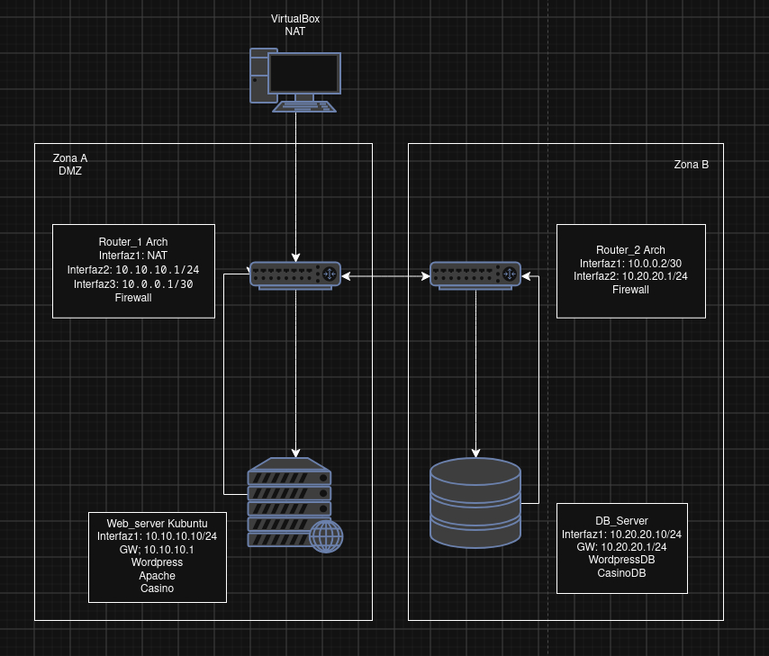
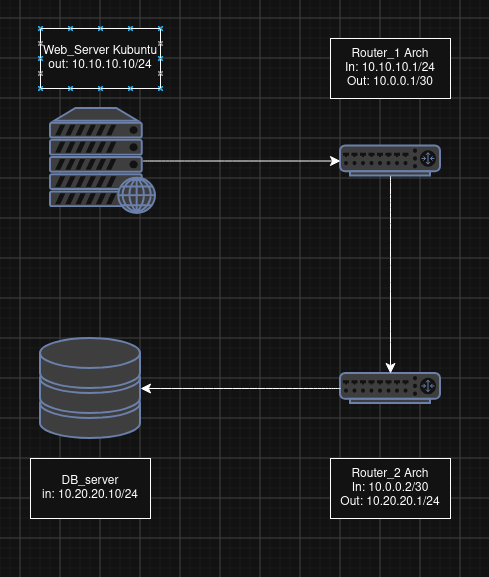
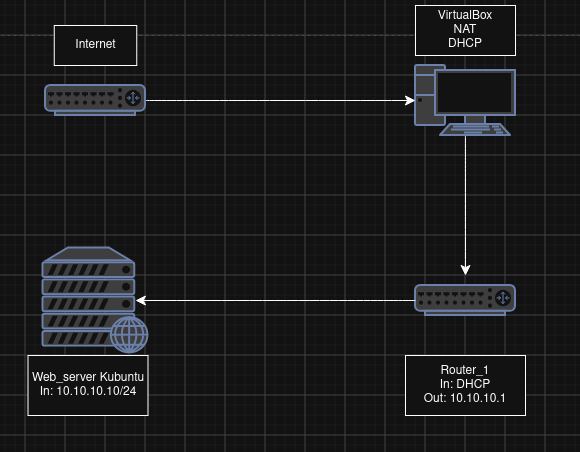
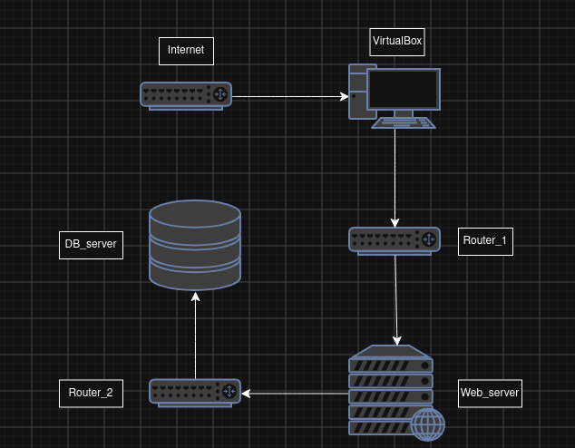

# Estructura física de la infraestructura

La infraestructura del proyecto estará formada por **cuatro máquinas virtuales** distribuidas en dos zonas de red. La finalidad de esta estructura es separar el servidor web del servidor de base de datos y simular una infraestructura distribuida entre dos ubicaciones o zonas de red diferentes.

La infraestructura estará compuesta por:

- **Servidor Web:** máquina virtual Kubuntu encargada de ejecutar Apache, PHP, WordPress y la aplicación del casino.
    
- **Servidor de Base de Datos:** máquina virtual Kubuntu encargada de ejecutar MariaDB y almacenar las bases de datos de WordPress y del casino.
    
- **Router 1:** máquina virtual Arch Linux encargada de gestionar la primera zona de red, proporcionar acceso a Internet mediante NAT y comunicar la DMZ con el Router 2.
    
- **Router 2:** máquina virtual Arch Linux encargada de conectar el enlace entre routers con la red interna donde se encuentra el servidor de base de datos.
    

### Distribución de las máquinas

La infraestructura se dividirá conceptualmente en dos zonas internas, además de la conexión mediante NAT para proporcionar salida a Internet.

**Zona A — Servidor Web**

El servidor web estará situado en una **DMZ**. Esta zona estará destinada al servicio web y estará separada de la red interna donde se encuentra la base de datos.

El acceso a Internet se realizará mediante **Router 1**, que dispondrá de una interfaz configurada mediante NAT en VirtualBox.

**Zona B — Servidor de Base de Datos**

El servidor de base de datos estará situado en una **red interna independiente**, protegida mediante el segundo router. El acceso a esta red estará restringido y únicamente se permitirán las comunicaciones necesarias desde el servidor web.

**Salida a Internet**

Router 1 dispondrá de una interfaz conectada a una red **NAT de VirtualBox**, permitiendo que la infraestructura tenga acceso a Internet.

De esta forma, Router 1 actuará como punto de salida hacia Internet y como elemento de comunicación entre la DMZ y el Router 2.

### Diagrama de red

### Redes utilizadas

Para mantener una separación clara entre los diferentes segmentos se utilizarán tres redes internas:

|Red|Dirección|Función|
|---|---|---|
|**NAT**|Configurada por VirtualBox|Salida de Router 1 a Internet|
|**DMZ**|`10.10.10.0/24`|Red del servidor web|
|**Enlace entre routers**|`10.0.0.0/30`|Comunicación entre Router 1 y Router 2|
|**Red interna**|`10.20.20.0/24`|Red del servidor de base de datos|

La red NAT será gestionada por VirtualBox, por lo que su direccionamiento dependerá de la configuración del entorno de virtualización.

### Direccionamiento inicial

|Dispositivo|Interfaz|Zona / Red|IP|Puerta de enlace|
|---|---|---|---|---|
|**Router 1**|`__________`|NAT|`DHCP`|`DHCP`|
|**Router 1**|`__________`|DMZ|`10.10.10.1/24`|—|
|**Router 1**|`__________`|Enlace R1 ↔ R2|`10.0.0.1/30`|—|
|**Servidor Web**|`__________`|DMZ|`10.10.10.10/24`|`10.10.10.1`|
|**Router 2**|`__________`|Enlace R1 ↔ R2|`10.0.0.2/30`|—|
|**Router 2**|`__________`|Red interna|`10.20.20.1/24`|—|
|**Servidor BD**|`__________`|Red interna|`10.20.20.10/24`|`10.20.20.1`|

La interfaz NAT de Router 1 obtendrá su configuración mediante **DHCP de VirtualBox**. Las direcciones de las redes internas se configurarán manualmente.

Usaremos una máscara de red **/30** para el enlace entre los routers, dado que esta red únicamente necesita dos direcciones IP utilizables, una para cada router.

### Comunicación entre zonas

La comunicación entre los servidores no será directa. El tráfico entre el servidor web y el servidor de base de datos tendrá que atravesar ambos routers:

Por otro lado, el tráfico destinado a Internet seguirá el siguiente recorrido:

Router 1 será, por tanto, el **punto de salida a Internet de la infraestructura**.

Esta estructura permitirá aplicar posteriormente reglas de **enrutamiento, NAT y firewall** para controlar las comunicaciones entre Internet, la DMZ y la red interna.

Por ejemplo, el servidor web podrá acceder al servidor de base de datos mediante **MariaDB (TCP/3306)**, mientras que otros tipos de tráfico podrán bloquearse.

### Objetivo de la estructura

La separación física y lógica de los servidores permite conseguir una arquitectura más cercana a un entorno real:

De esta manera, un posible compromiso del servidor web no implica automáticamente un acceso directo al servidor de base de datos. La comunicación entre las diferentes zonas queda controlada por los routers y sus reglas de filtrado.

Además, Router 1 permitirá proporcionar salida a Internet a los equipos de la infraestructura mediante **NAT**, mientras que Router 2 se encargará de mantener separada la red interna donde se encuentra el servidor de base de datos.

La infraestructura también permitirá ampliar posteriormente el proyecto incorporando nuevas máquinas, servicios o redes sin tener que modificar completamente la arquitectura existente.
