# Instalación de Arch Linux

Esta guía describe el procedimiento seguido para realizar una instalación base de **Arch Linux** en una máquina virtual. El sistema instalado se utilizará posteriormente como base para los dos routers de la infraestructura, por lo que no se instalará ningún entorno gráfico.

La configuración específica de cada router, incluyendo **NetworkManager, enrutamiento, NAT e iptables**, se realizará posteriormente en sus respectivas guías.

> [!NOTE] ## ¿Por qué Arch Linux?
> He elegido Arch Linux porque permite crear un sistema simple y funcional, aprovechando al máximo los recursos de la máquina y evitando instalar paquetes innecesarios. Además, su proceso de instalación es más manual que el de otras distribuciones, por lo que supone un reto interesante y una oportunidad para comprender mejor el funcionamiento interno del sistema.
## Requisitos

Para realizar la instalación de **Arch Linux** necesitaremos los siguientes elementos:

- Conexión a Internet.
    
- La imagen ISO de **Arch Linux**, descargada desde su página web oficial.
    
- **VirtualBox** para crear y ejecutar la máquina virtual.
    

## Creación y configuración de la máquina virtual

Antes de comenzar la instalación de Arch Linux, se creará una máquina virtual en **VirtualBox** con las características necesarias para el proyecto.

### Configuración básica

Se utilizará la siguiente configuración:

| Recurso           | Configuración   |
| ----------------- | --------------- |
| Sistema operativo | Linux           |
| Arquitectura      | 64 bits         |
| Memoria RAM       | 2 GB            |
| Procesador        | 1               |
| Almacenamiento    | 15 GB           |
| Firmware          | UEFI            |
| Entorno gráfico   | No se instalará |

Se seleccionará **Linux** como tipo de sistema operativo y una versión de **64 bits**. Es importante utilizar una arquitectura de 64 bits, ya que la ISO actual de Arch Linux requiere una CPU x86-64.

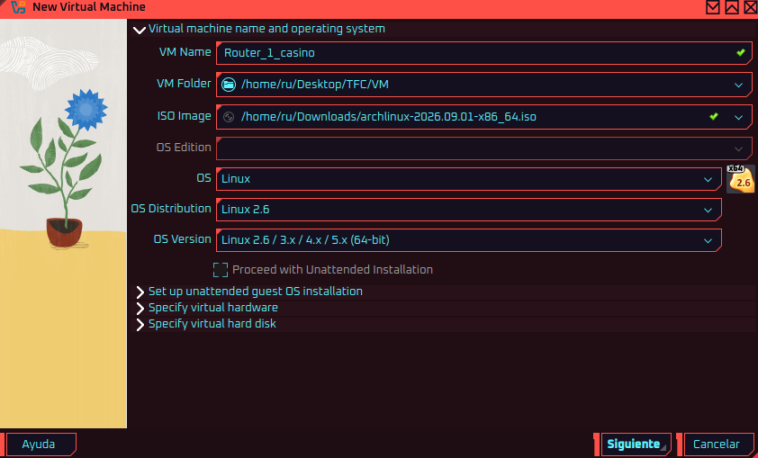

Se asignarán **2 GB de RAM**, **1 procesador** y se marcará la opción **Habilitar EFI (sistemas operativos especiales)**. Al no utilizar un entorno gráfico, estos recursos serán suficientes tanto para la instalación como para los servicios que se ejecutarán posteriormente.

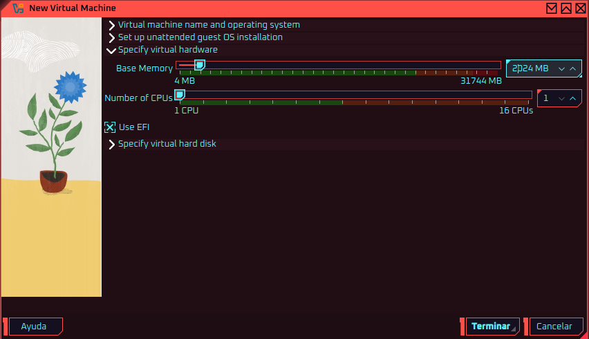

Para el almacenamiento se asignarán **15 GB** mediante un disco virtual de tamaño dinámico. Aunque una instalación básica puede realizarse utilizando menos espacio, se ha decidido disponer de margen suficiente para futuras instalaciones, paquetes y configuraciones.

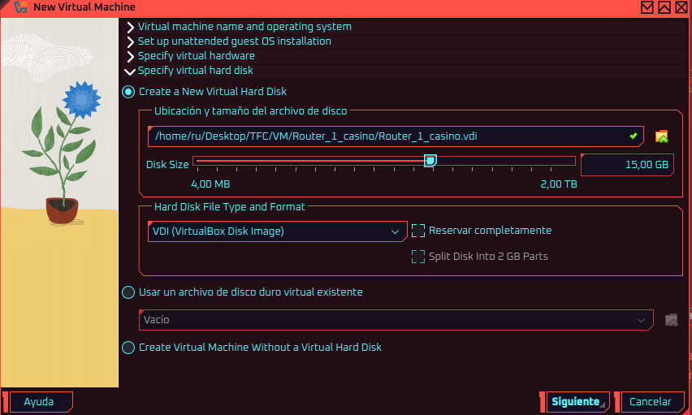

Con las opciones configuradas correctamente, tras iniciar la máquina virtual se mostrará la siguiente terminal:

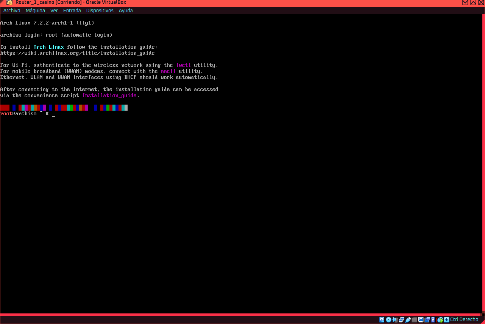

### Sistema

En **Configuración → Sistema → Placa base** se activará:
    
- **Reloj hardware en UTC**.

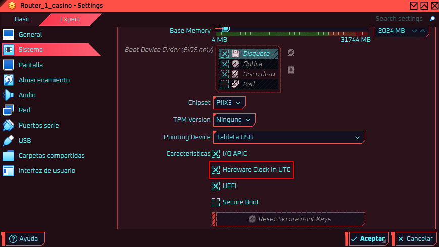

En **Configuración → Sistema → Procesador** se asignarán:
    
- **PAE/NX**: Habilitado.
      
- **VT-x/AMD-V**: habilitado.

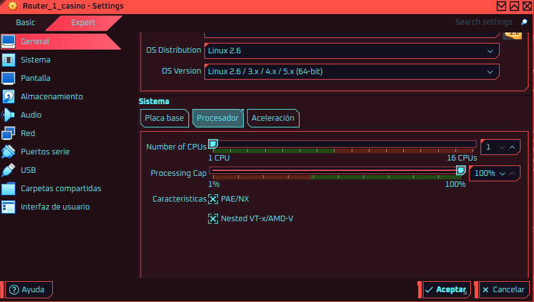

En **Configuración → Sistema → Aceleración** se utilizarán las opciones de virtualización por hardware disponibles:
     
- **Paginación anidada**: habilitada.
    
- **Para virtualización**: `Predeterminada`.


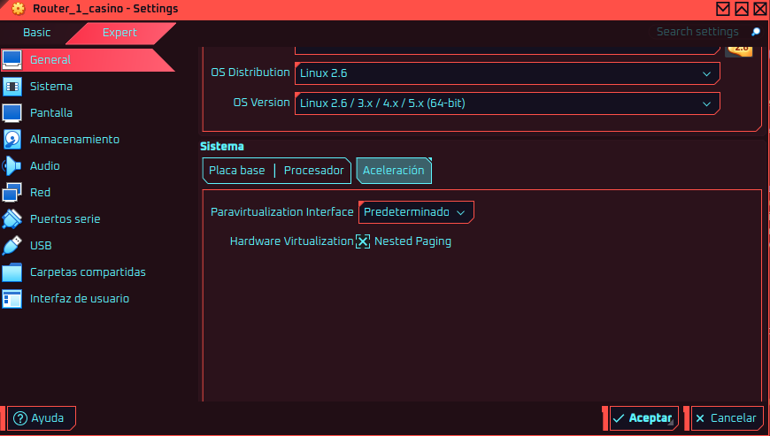

La virtualización por hardware permite que la máquina virtual pueda utilizar correctamente las características de virtualización proporcionadas por el procesador físico.

#### Justificación de las opciones seleccionadas

Las opciones seleccionadas permiten que la máquina virtual disponga de un entorno de ejecución adecuado para **Arch Linux** y aproveche correctamente las capacidades de virtualización del equipo anfitrión.

- **Reloj hardware en UTC**: se utiliza para mantener una referencia horaria estándar en la máquina virtual y evitar problemas relacionados con la configuración de la hora.
    
- **PAE/NX**: se habilita para proporcionar al sistema invitado las funciones de gestión de memoria y protección de ejecución disponibles en el procesador.
    
- **VT-x/AMD-V**: permite utilizar la virtualización asistida por hardware del procesador físico. Es necesaria para que VirtualBox pueda ejecutar la máquina virtual de forma adecuada.
    
- **Paginación anidada**: mejora la gestión de la memoria virtual al permitir que el procesador físico gestione de forma más eficiente las direcciones de memoria utilizadas por el sistema invitado.
    
- **Para virtualización — Predeterminada**: permite que VirtualBox seleccione automáticamente el mecanismo de paravirtualización apropiado para el sistema operativo invitado.
    

En conjunto, estas opciones proporcionan la configuración necesaria para ejecutar **Arch Linux de forma estable y eficiente**, sin asignar recursos adicionales que no sean necesarios para el funcionamiento de los routers.
### Configuración de red

La configuración de los adaptadores dependerá de la función que tendrá la máquina dentro de la infraestructura.

Para **Router 1**, se utilizarán tres adaptadores:

| Adaptador   | Conectado a         | Función                          | Capturas                                                       |
| ----------- | ------------------- | -------------------------------- | -------------------------------------------------------------- |
| Adaptador 1 | NAT                 | Acceso a Internet                | 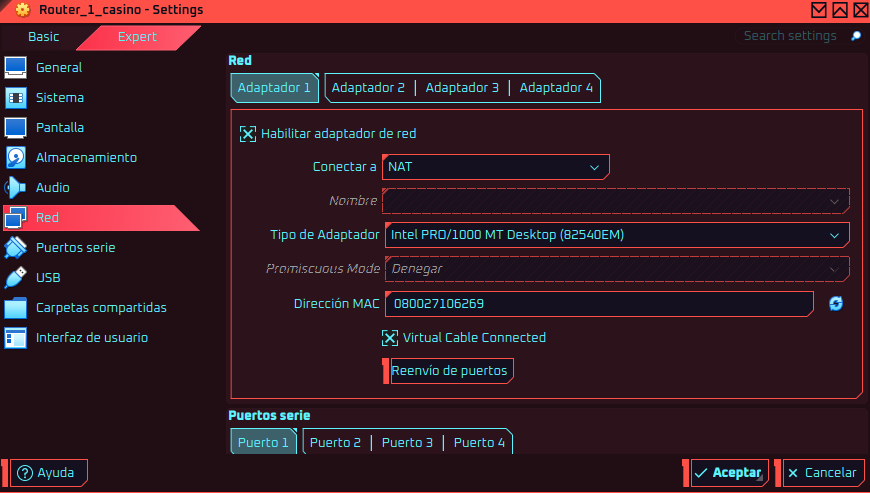 |
| Adaptador 2 | Red interna `DMZ`   | Comunicación con el servidor Web | 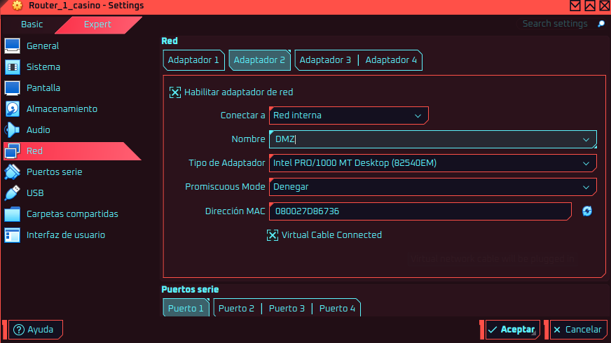 |
| Adaptador 3 | Red interna `R1-R2` | Enlace con Router 2              | 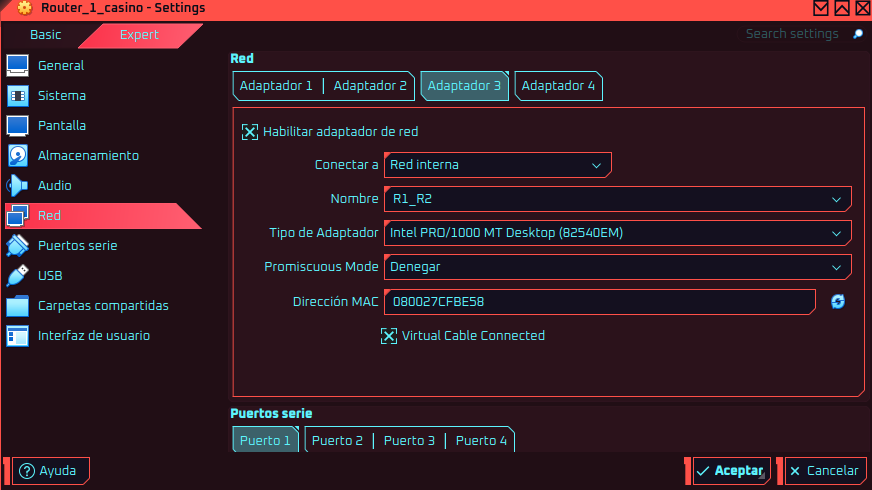 |

Para **Router 2**, se utilizarán dos adaptadores:

| Adaptador   | Conectado a         | Función                         | Capturas                                                       |
| ----------- | ------------------- | ------------------------------- | -------------------------------------------------------------- |
| Adaptador 1 | Red interna `R1-R2` | Enlace con Router 1             | 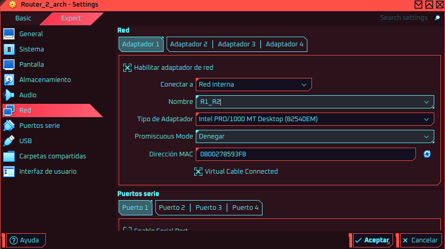 |
| Adaptador 2 | Red interna `InNet` | Comunicación con la red interna | 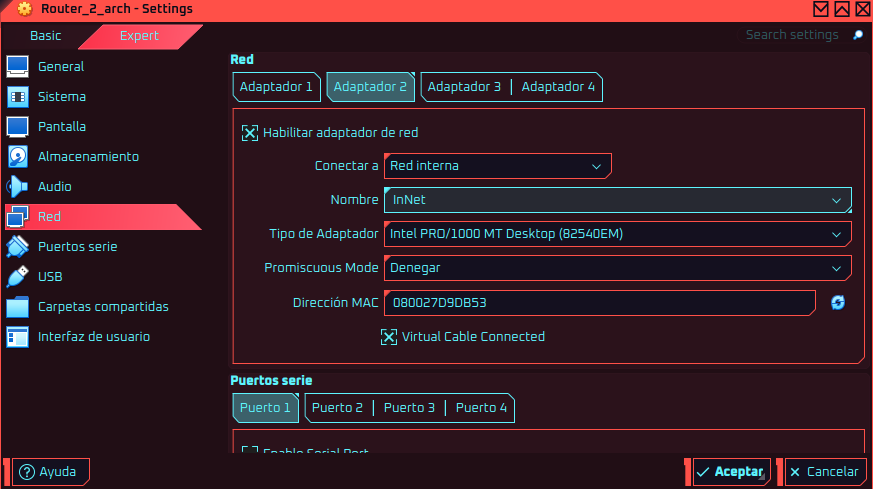              |

En esta fase se realizará la instalación de los dos routers de la infraestructura de forma **secuencial**, comenzando por **Router 1** y continuando posteriormente con **Router 2**, ya que este último dependerá de Router 1 para disponer de conectividad durante su instalación.

Los adaptadores virtuales de red de ambas máquinas se han configurado previamente en **VirtualBox**. Las direcciones IP y el funcionamiento de las interfaces se establecerán posteriormente mediante **NetworkManager**.

## Instalación de Router 1

Pasos a seguir durante la instalacion:
1. [Comprobación de la conexión a Internet](#Comprobación%20de%20la%20conexión%20a%20Internet)
2. [Particionado y formateo](#Particionado%20y%20formateo)
3. [Montaje de las particiones](#Montaje%20de%20las%20particiones)
4. [Instalacion del sistema base, kernel y firmware](#Instalacion%20del%20sistema%20base,%20kernel%20y%20firmware)|Instalacion del sistema base, kernel y firmware]
5. [Configuracion base](#Configuracion%20base)
6. Configuracion del gestor de arranque 
7. Creacion de usuario y configuracion de permisos
8. Reinicio y comprobacion del sistema

### Comprobación de la conexión a Internet

Antes de comenzar la instalación se comprobará que la máquina virtual dispone de conexión a Internet. Para ello se utilizará el comando `ping`, enviando una solicitud a `google.com`:

```bash
ping google.com
```

En caso de tener internet se veria lo siguiente:

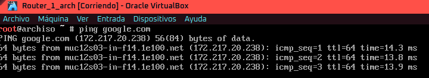

### Particionado y formateo
Ya comprobada la conexión a Internet, se procede a preparar el disco para la instalación.

Para ello, se utilizará `cfdisk` para crear una tabla de particiones **GPT** y definir las dos particiones necesarias para que el sistema funcione correctamente.

Primero, se debe identificar el disco sobre el que se realizará la instalación mediante el comando:

```shell
lsblk
```

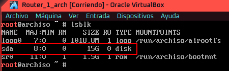

En nuestro caso, el disco correspondiente es `/dev/sda`.

A continuación, se inicia `cfdisk` sobre el disco seleccionado mediante:

```shell
cfdisk /dev/sda
```

Dentro de `cfdisk`, se seleccionó **GPT** como tabla de particiones para el disco.

Se eligió este tipo de tabla debido a que el sistema utilizará **UEFI** para el arranque, siendo GPT el formato recomendado para este tipo de configuración.
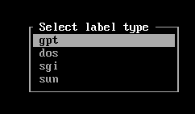

A continuación, se crearon las dos particiones necesarias para la instalación:

- **Partición de arranque:** se asignó un tamaño de **1 GB** y se seleccionó el tipo **EFI System**, destinada al arranque mediante UEFI.

    
- **Partición del sistema:** se asignó el espacio restante, aproximadamente **14 GB**, y se seleccionó el tipo **Linux filesystem**, destinada al sistema de archivos raíz (`/`).

> [!NOTE] ¿Por qué usamos GPT?
> Se utiliza una tabla de particiones **GPT** junto con **UEFI** debido a que es una configuración moderna y permite utilizar una partición EFI independiente para el arranque del sistema.

> [!NOTE] ¿Por qué asignamos 1GB a la partición EFI
> Se ha asignado un tamaño de **1 GB** a la partición EFI, aunque el espacio necesario para los archivos de arranque es considerablemente menor. Se ha elegido este tamaño para disponer de espacio suficiente para los archivos relacionados con el arranque y posibles configuraciones futuras


Una vez configuradas las particiones, se seleccionó la opción para **escribir los cambios en el disco**, confirmando la operación. Finalmente, se salió de `cfdisk`.

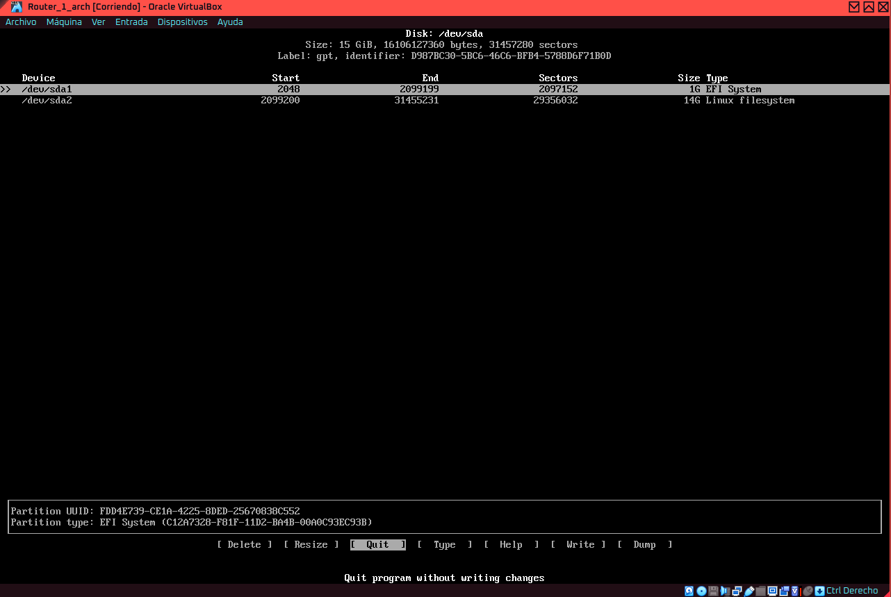

Una vez finalizado el particionado, se verificó que las particiones se habían creado correctamente mediante el comando:

```shell
lsblk
```

Con este comando se comprobó que el disco `/dev/sda` contenía las dos particiones creadas anteriormente: la partición de arranque de **1 GB** y la partición destinada al sistema de aproximadamente **14 GB**.

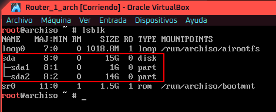

Una vez creadas las particiones, se procede a formatearlas utilizando `mkfs`.

En la partición de arranque se utilizará el sistema de archivos **FAT32**, mientras que en la partición destinada al sistema se utilizará **ext4**.

> [!NOTE] ¿Por qué he elegido FAT32?
> La partición EFI se formatea utilizando **FAT32**, ya que este es el sistema de archivos utilizado habitualmente por las particiones del sistema EFI y es compatible con el firmware UEFI.

> [!NOTE] ¿Por qué he elegido ext4?
> Para la partición raíz se ha seleccionado **ext4** por ser un sistema de archivos ampliamente utilizado en sistemas Linux, ofreciendo estabilidad, buen rendimiento y compatibilidad con Arch Linux.

Usaremos los siguientes comandos 
```shell
mkfs.fat -F 32 /dev/sda1
mkfs.ext4 /dev/sda2
```

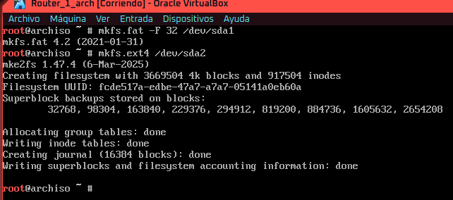

El primer comando formatea `/dev/sda1` en **FAT32**, mientras que el segundo formatea `/dev/sda2` en **ext4**.


> [!NOTE] Configuración del teclado
> Durante el proceso de instalación se detectó que la distribución del teclado estaba configurada en **inglés**, lo que podía provocar problemas al introducir determinados caracteres y comandos.
> 
> Para solucionarlo, se cambió temporalmente la distribución del teclado a **español** mediante el siguiente comando:
> 
> ```shell
>loadkeys es
>```
>
>Una vez ejecutado el comando, el teclado quedó configurado correctamente para continuar con la instalación.

### Montaje de las particiones
Una vez creadas, formateadas y comprobadas las particiones, se procede a montarlas para poder comenzar con la instalación del sistema.

Primero, se monta la partición destinada al sistema de archivos raíz (`/`) en el directorio `/mnt`:

```shell
mount /dev/sda2 /mnt
```

A continuación, se crea el directorio donde se montará la partición de arranque:

```shell
mkdir -p /mnt/boot
```

Finalmente, se monta la partición EFI en el directorio `/mnt/boot`:

```shell
mount /dev/sda1 /mnt/boot
```

De esta forma, la partición `/dev/sda2` queda montada como sistema de archivos raíz (`/`) y `/dev/sda1` como partición EFI de arranque.

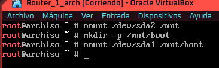

### Instalacion del sistema base, kernel y firmware
Se ha hecho uso de `pacstrap` para instalar el sistema base de Arch Linux, el kernel y el firmware necesario:

```shell
pacstrap -K /mnt base linux linux-firmware
```

Una vez finalizada la instalación, se comprobó que los archivos del sistema se habían generado correctamente dentro de `/mnt` mediante el siguiente comando:

```shell
ls /mnt
```

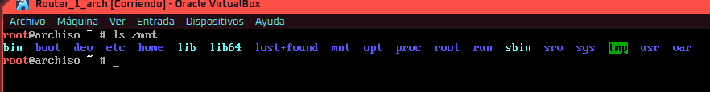

Como se puede observar en la imagen, el contenido del directorio muestra que el sistema base de Arch Linux se ha instalado correctamente.

A continuación, se hizo uso del comando `genfstab` para generar las entradas correspondientes a las particiones montadas y guardarlas en `/mnt/etc/fstab`, utilizando sus respectivos UUID:

```shell
genfstab -U /mnt >> /mnt/etc/fstab
```


> [!NOTE] Justificación genfstab
> La generación del archivo `fstab` permite que el sistema instalado conozca qué particiones debe montar y en qué puntos de montaje durante el arranque. Se utilizan los UUID para identificar las particiones de forma independiente del nombre que el kernel pueda asignarles.

Una vez generado el archivo, se comprobó que se había creado correctamente mediante el comando `cat`:

```shell
cat /mnt/etc/fstab
```

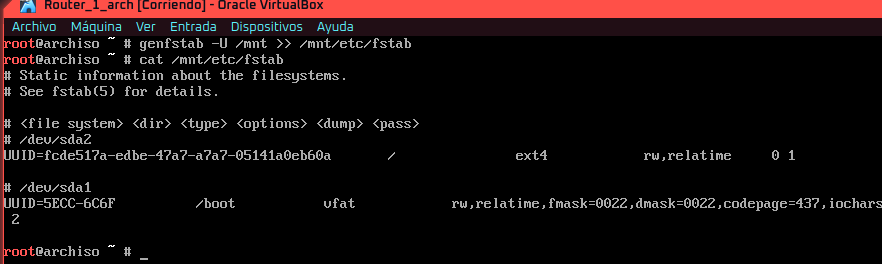

Posteriormente, se accedió al sistema instalado mediante `chroot` para continuar con la configuración del sistema:

```shell
arch-chroot /mnt
```

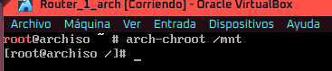
### Configuracion base
Una vez dentro del sistema se comenzaron las configuraciones básicas
#### Zona horaria
Se hizo uso del comando `ln` para crear un enlace simbólico entre la zona horaria de Madrid y el archivo `/etc/localtime`, permitiendo establecer correctamente la zona horaria del sistema:

```shell
ln -sf /usr/share/zoneinfo/Europe/Madrid /etc/localtime
```

Posteriormente, se sincronizó el reloj de hardware con la hora del sistema mediante el comando `hwclock`:

```shell
hwclock --systohc
```

Finalmente, se verificó que la hora se había configurado correctamente mediante el comando `date`:

```shell
date
```

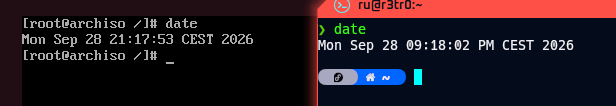

> [!NOTE] ¿Para qué configurar correctamente fecha y hora?
> La correcta configuración de la fecha y hora es importante para garantizar el funcionamiento adecuado de servicios como los registros del sistema, las tareas programadas, los certificados y la sincronización de datos.

#### Configuración regional de sistema
El idioma del sistema se mantuvo en **inglés**, principalmente por preferencia personal y por familiaridad con este entorno.

Además, **Arch Linux** es una distribución desarrollada y mantenida principalmente por su comunidad, por lo que parte de su documentación, herramientas y mensajes del sistema se encuentran originalmente en inglés. Aunque la traducción al español ha mejorado con el tiempo, mantener el sistema en inglés facilita la consulta de documentación y la interpretación de mensajes y errores.

Por otro lado, ya existía familiaridad con los comandos, mensajes de confirmación, nombres de directorios y demás elementos del sistema en inglés, por lo que mantener este idioma permitía trabajar de forma más rápida y evitar cambios innecesarios durante la configuración.

Lo primero que se hizo fue editar el archivo `/etc/locale.gen` para seleccionar el idioma del sistema. Para ello, se buscó la línea correspondiente a `en_US.UTF-8 UTF-8` y se eliminó el carácter `#` para descomentaría.

Para editar el archivo se utilizó **nano**:

```shell
nano /etc/locale.gen
```

Durante este proceso se detectó que **nano** no estaba instalado. Aunque su instalación estaba prevista para una fase posterior, se instaló en ese momento al ser necesario para continuar con la configuración:

```shell
pacman -S nano
```

Una vez instalada la herramienta, se editó nuevamente `/etc/locale.gen` y se descomentó la siguiente línea:

```text
en_US.UTF-8 UTF-8
```

Finalmente, se generó el locale seleccionado mediante:

```shell
locale-gen
```

Este comando generó los archivos necesarios para que el sistema pudiera utilizar `en_US.UTF-8` como configuración regional.

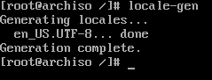

Lo siguiente es configurar el inglés como idioma predeterminado del sistema mediante `echo`:

```shell
echo "LANG=en_US.UTF-8" > /etc/locale.conf
```

Posteriormente, se comprobó que la configuración se ha realizado correctamente mediante `cat`:

```shell
cat /etc/locale.conf
```

La salida del comando fue:

```text
LANG=en_US.UTF-8
```

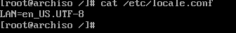

#### COnfiguracón para el teclado
Anteriormente se configuró el teclado en español de forma temporal mediante `loadkeys es`. No obstante, esta configuración solo se mantiene durante la sesión actual. A continuación, se establecerá de forma permanente.

Para ello, se creó el archivo `/etc/vconsole.conf` mediante `echo`:

```shell
echo "KEYMAP=es" > /etc/vconsole.conf
```

Posteriormente, se comprobó su contenido mediante `cat`:

```shell
cat /etc/vconsole.conf
```

La salida mostró:

```text
KEYMAP=es
```

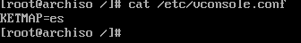

#### Nombre de la máquina
Lo siguiente que se configuró fue el **hostname**. En este caso, al tratarse del primer router de la infraestructura, se utilizó el nombre **`router_1`**.

Para ello, se escribió el hostname deseado en `/etc/hostname` mediante `echo`:

```shell
echo "router_1" > /etc/hostname
```

Para comprobar que se había configurado correctamente, se mostró el contenido del archivo mediante `cat`:

```shell
cat /etc/hostname
```

La salida obtenida fue:

```text
router_1
```

También se intentó comprobar el hostname actual mediante el comando `hostname`:

```shell
hostname
```

Sin embargo, se obtuvo un error indicando que el comando no estaba disponible.

Esto se debe a que la instalación base de Arch Linux no incluye necesariamente la herramienta necesaria para ejecutar este comando. No supuso un problema para la configuración realizada, ya que el hostname se había establecido correctamente en `/etc/hostname`, que será utilizado por el sistema durante el arranque.

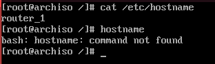


> [!NOTE] Pausa en la instalación
> **30/09/2026**
>
>Debido a la finalización de la sesión de trabajo y a que al día siguiente había clases, se decidió pausar temporalmente la instalación para continuar posteriormente desde el punto en el que se había dejado.
>
>Para ello, se desmontaron las particiones que se encontraban montadas en `**/mnt**` y se apagó la máquina virtual:
>
>```
exit
umount -R /mnt
shutdown now
>```
>
>Para reanudar la instalación, será necesario arrancar nuevamente la máquina virtual desde la **ISO de Arch Linux**, montar las particiones y acceder al sistema instalado mediante `arch-chroot`:
>
>```
mount /dev/sda2 /mnt
mount --mkdir /dev/sda1 /mnt/boot
arch-chroot /mnt
>```
>
>Esto es necesario porque todavía no se ha instalado el **bootloader**, por lo que el sistema instalado aún no puede arrancar directamente desde el disco y se necesita la ISO de instalación para continuar con el proceso.

Tras una pausa se ha vuelto al sistema para proseguir con la instalación.

#### Instalación del gestor de arranque
Se instaló el **systemd-boot** con el siguiente comando:

```
bootctl install
```

Y se obtuvo la siguiente salida:
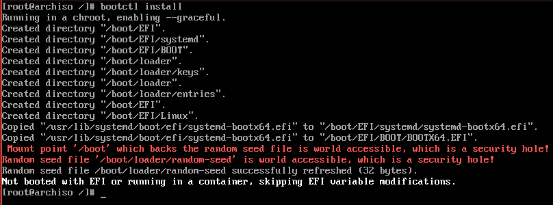

El comando `bootctl install` instala **systemd-boot** como gestor de arranque en la partición EFI montada en `/boot`.

Durante el proceso se crearon los directorios necesarios para el arranque, como `EFI/systemd`, `EFI/BOOT` y `loader`, y se copiaron los archivos `.efi` necesarios para que el firmware UEFI pueda localizar el gestor de arranque.

La salida también muestra algunos avisos relacionados con los permisos de `/boot` y con la modificación de las variables EFI. Estos avisos no impiden la instalación y son esperables al ejecutar el comando desde el entorno `chroot` utilizado durante la instalación.

Por tanto, la instalación del gestor de arranque se realizó correctamente.

##### Configuración de systemd-boot

Una vez instalado `systemd-boot`, se configuraron los archivos necesarios para establecer el comportamiento del gestor de arranque y definir la entrada correspondiente al sistema Arch Linux.

###### Configuración de `loader.conf`

En primer lugar, se editó el archivo `/boot/loader/loader.conf`:

```shell
nano /boot/loader/loader.conf
```

Se estableció el siguiente contenido:

```text
default arch.conf
timeout 3
editor no
```

Las opciones utilizadas tienen las siguientes funciones:

- **`default arch.conf`**: establece `arch.conf` como la entrada de arranque predeterminada.
    
- **`timeout 3`**: establece un tiempo de espera de 3 segundos antes de iniciar automáticamente la entrada predeterminada.
    
- **`editor no`**: desactiva la posibilidad de modificar los parámetros de arranque desde el menú de `systemd-boot`.
    

###### Creación de la entrada del sistema

A continuación, se creó la entrada correspondiente al sistema Arch Linux en el directorio utilizado por `systemd-boot`:

```text
/boot/loader/entries/arch.conf
```

Para obtener el UUID de la partición raíz `/dev/sda2`, se utilizó el siguiente comando:

```shell
blkid -s UUID -o value /dev/sda2 > /boot/loader/entries/arch.conf
```

Este comando está compuesto por varias partes:

- **`blkid`**: herramienta utilizada para mostrar información sobre los dispositivos de almacenamiento y sus sistemas de archivos.
    
- **`-s UUID`**: indica que únicamente se quiere obtener el atributo `UUID` de la partición.
    
- **`-o value`**: hace que `blkid` muestre únicamente el valor del UUID, sin incluir el nombre de la partición ni el texto `UUID=`.
    
- **`/dev/sda2`**: indica la partición de la que se quiere obtener el UUID. En este caso, corresponde a la partición raíz del sistema.
    
- **`>`**: redirige la salida del comando hacia un archivo. Si el archivo ya existe, su contenido anterior se sobrescribe.
    
- **`/boot/loader/entries/arch.conf`**: archivo en el que se almacena inicialmente el UUID obtenido.
    

Por tanto, después de ejecutar el comando, el archivo contiene únicamente el UUID de la partición raíz. Esto permite obtener directamente desde el sistema el identificador que posteriormente se utilizará en la configuración de `systemd-boot`, evitando introducirlo manualmente y reduciendo la posibilidad de cometer errores.

Una vez obtenido el UUID, se editó manualmente el archivo para completar la entrada de arranque:

```shell
nano /boot/loader/entries/arch.conf
```

El archivo se configuró finalmente con la siguiente estructura:

```text
title   Arch Linux
linux   /vmlinuz-linux
initrd  /initramfs-linux.img
options root=UUID=UUID_DE_LA_PARTICION rw
```

En la línea `options`, `UUID_DE_LA_PARTICION` se sustituyó por el UUID obtenido anteriormente mediante `blkid`.

Las diferentes líneas tienen las siguientes funciones:

- **`title Arch Linux`**: establece el nombre que se mostrará para esta entrada en el menú de `systemd-boot`.
    
- **`linux /vmlinuz-linux`**: indica la ubicación del kernel de Linux que debe cargar `systemd-boot`.
    
- **`initrd /initramfs-linux.img`**: indica la imagen `initramfs` que se cargará junto con el kernel. Esta imagen contiene los componentes necesarios para realizar las operaciones iniciales durante el proceso de arranque.
    
- **`options root=UUID=... rw`**: especifica mediante `root=UUID=...` qué partición contiene el sistema de archivos raíz. En este caso se utiliza el UUID de `/dev/sda2`. El parámetro `rw` indica que el sistema de archivos raíz debe montarse inicialmente en modo lectura/escritura.
    

El uso del UUID permite identificar la partición raíz mediante un identificador único en lugar de depender directamente del nombre del dispositivo, como `/dev/sda2`.

###### Comprobación de la configuración

Una vez finalizada la configuración, se comprobó el estado del gestor de arranque mediante:

```shell
bootctl status
```

Y se obtuvo la siguiente salida:
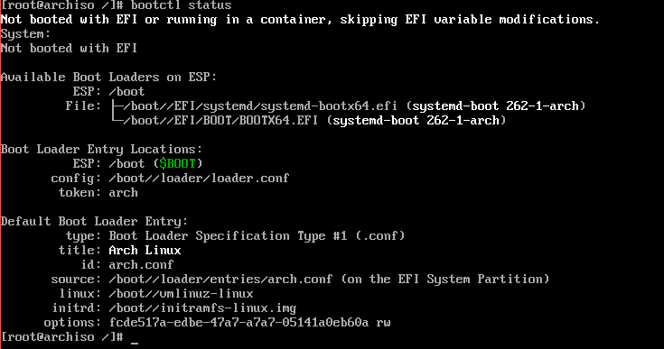

Este comando permite consultar el estado de `systemd-boot` y comprobar información como:

- Si el sistema ha iniciado en modo EFI.
    
- La partición EFI utilizada.
    
- La versión de `systemd-boot` instalada.
    
- La ubicación de los archivos del gestor de arranque.
    
- Las entradas de arranque detectadas.

### Error durante el primer arranque

Se intentó iniciar la máquina virtual desde el disco donde se había instalado Arch Linux. Sin embargo, durante el proceso de arranque se produjo un error que impidió que el sistema operativo iniciara correctamente.

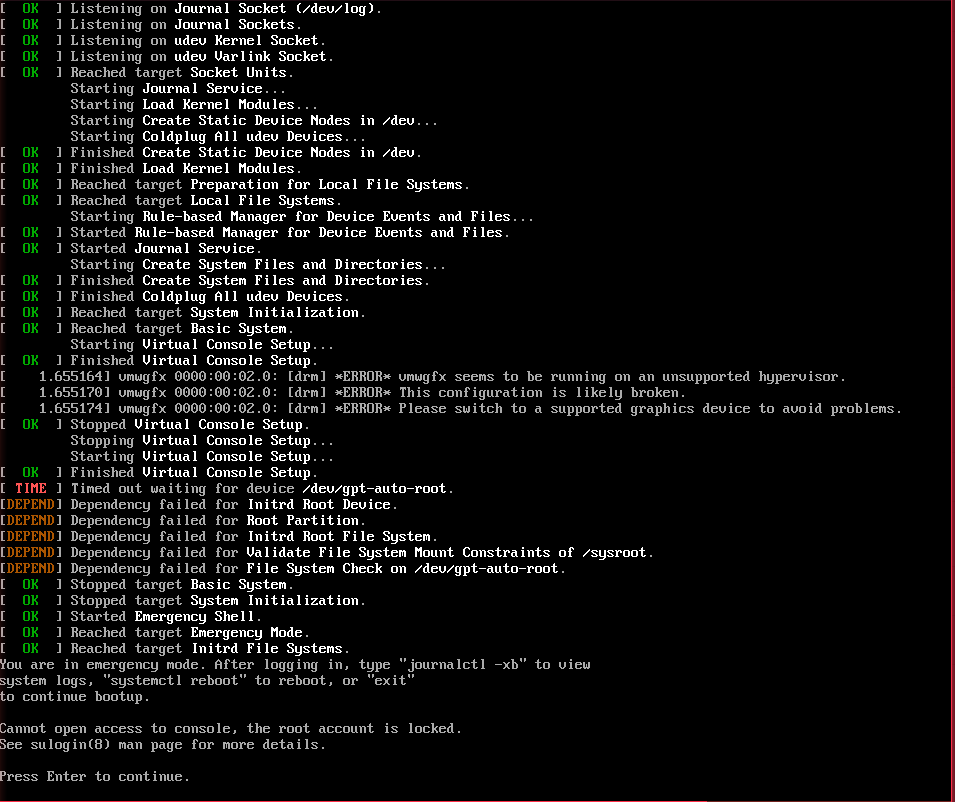

El mensaje más relevante mostrado durante el arranque fue:

```text
[ TIME ] Timed out waiting for device /dev/gpt-auto-root
[DEPEND] Dependency failed for Initrd Root Device.
[DEPEND] Dependency failed for Root Partition.
[DEPEND] Dependency failed for Initrd Root File System.
[DEPEND] Dependency failed for Validate File System Mount Constraints of /sysroot.
[DEPEND] Dependency failed for File System Check on /dev/gpt-auto-root.
```

El mensaje:

```text
Timed out waiting for device /dev/gpt-auto-root
```

indica que el sistema no pudo localizar dentro del tiempo establecido el dispositivo que esperaba utilizar como partición raíz.

Como consecuencia, las dependencias relacionadas con la partición raíz también fallaron y el sistema no pudo montar correctamente el sistema de archivos en `/sysroot`.

Finalmente, el sistema entró en **modo de emergencia**:

```text
You are in emergency mode.
```

Por tanto, el sistema operativo no pudo completar el proceso de arranque y fue necesario volver al entorno de instalación de Arch Linux para comprobar la configuración de la partición raíz y de la entrada de `systemd-boot`.

Durante el arranque también apareció el siguiente mensaje relacionado con `vmwgfx`:

```text
[drm] *ERROR* vmwgfx seems to be running on an unsupported hypervisor.
[drm] *ERROR* This configuration is likely broken.
```

Este mensaje está relacionado con el controlador gráfico virtual utilizado por la máquina virtual. No es el error que provoca el fallo principal del arranque; el problema que impide continuar es la imposibilidad de localizar la partición raíz.

##### Solución
Para solucionarlo, se sospechó que el identificador del disco estaba mal configurado. Para comprobarlo, se inició nuevamente el sistema Arch Linux desde la **Live ISO**, como se mostró anteriormente, y se compararon los identificadores de las particiones con los configurados en `systemd-boot`.

No obstante, el identificador estaba correctamente configurado. El problema provenía de que no estaba bien implementado en el archivo `arch.conf`, ya que faltaba indicar la partición raíz mediante la opción `root=UUID`.

Se corrigió la línea `options` para que quedara de la siguiente forma:

```text
options root=UUID=UUID_DE_LA_PARTICION rw
```

De esta forma, `systemd-boot` puede indicar al kernel qué partición debe utilizar como sistema de archivos raíz durante el arranque.
#### 

Con esta configuración, `systemd-boot` dispone de una entrada que permite localizar el kernel de Arch Linux, cargar su `initramfs` y utilizar la partición `/dev/sda2` como sistema de archivos raíz durante el proceso de arranque.

A partir de este punto, se pudo realizar el primer arranque del sistema instalado. Para ello, primero se salió del entorno `chroot` mediante el comando:

```shell
exit
```

A continuación, se desmontaron de forma recursiva las particiones que habían sido montadas durante la instalación mediante:

```shell
umount -R /mnt
```

Una vez desmontadas las particiones, se apagó la máquina mediante:

```shell
shutdown now
```

Antes de volver a iniciar la máquina virtual, se retiró la imagen ISO de Arch Linux del dispositivo óptico virtual de VirtualBox. Esto permite que, en el siguiente arranque, el sistema utilice el disco virtual donde se ha realizado la instalación en lugar de volver a iniciar el instalador de Arch Linux.

Posteriormente, se inició nuevamente la máquina virtual y el sistema operativo arrancó correctamente desde el disco instalado, utilizando `systemd-boot` como gestor de arranque, tal y como se puede observar en la siguiente captura.


Sin embargo, no se habían creado los usuarios ni establecido una contraseña para `root`. Por este motivo, se volvió a insertar la **Live ISO**, se inició la máquina y se utilizó la **UEFI** para arrancar desde ella.

Una vez iniciado el sistema desde la ISO, se volvió a montar el sistema instalado y se realizaron las operaciones necesarias para crear los usuarios y establecer sus contraseñas, como se mostrará más adelante.

> [!NOTE] Contraseñas
> Aunque el entorno de pruebas intenta simular una infraestructura similar a un entorno real, durante la fase de desarrollo se ha decidido utilizar una contraseña común para simplificar la configuración y agilizar las pruebas.

Por este motivo, en los sistemas Linux utilizados durante el proyecto se empleará la contraseña `qwerty` siempre que sea posible. Esta decisión se toma únicamente por motivos de desarrollo y documentación, ya que en un entorno real de producción se deberían utilizar contraseñas únicas, robustas y diferentes para cada usuario y servicio.
##### Configuración de usuarios

Se ha comenzado estableciendo la contraseña del usuario `root` mediante el comando `passwd`, asignándole la contraseña `qwerty`.

A continuación, se ha creado el usuario `administrador` mediante el comando:

```bash
useradd administrador
```

y se le ha asignado una contraseña utilizando:

```bash
passwd administrador
```

El usuario `administrador` no se añadirá al grupo `wheel` ni dispondrá actualmente de permisos para utilizar `sudo`. Esta decisión se toma para mantener una separación entre el usuario principal del sistema y la cuenta de superusuario, evitando conceder privilegios elevados de forma permanente a usuarios que no los necesitan durante esta fase del proyecto.

Aunque la creación de este usuario no es estrictamente necesaria en la configuración inicial del router, ya que todas las tareas administrativas pueden realizarse mediante la cuenta `root`, se ha decidido incluirlo como medida preventiva. De esta forma, se dispone de una cuenta adicional que puede utilizarse para realizar pruebas o que puede recibir permisos específicos en el futuro si fueran necesarios.

Esta configuración permite mantener una estructura más flexible, ya que en caso de requerir un usuario con privilegios administrativos limitados se podrá modificar posteriormente sin necesidad de crear una nueva cuenta.

Con esta última configuración se ha completado la configuración básica del primer router. A partir de este punto, ya es posible iniciar sesión correctamente en la máquina sin necesidad de utilizar la sesión Live, permitiendo continuar con la configuración del resto de componentes y servicios necesarios para el funcionamiento del router.